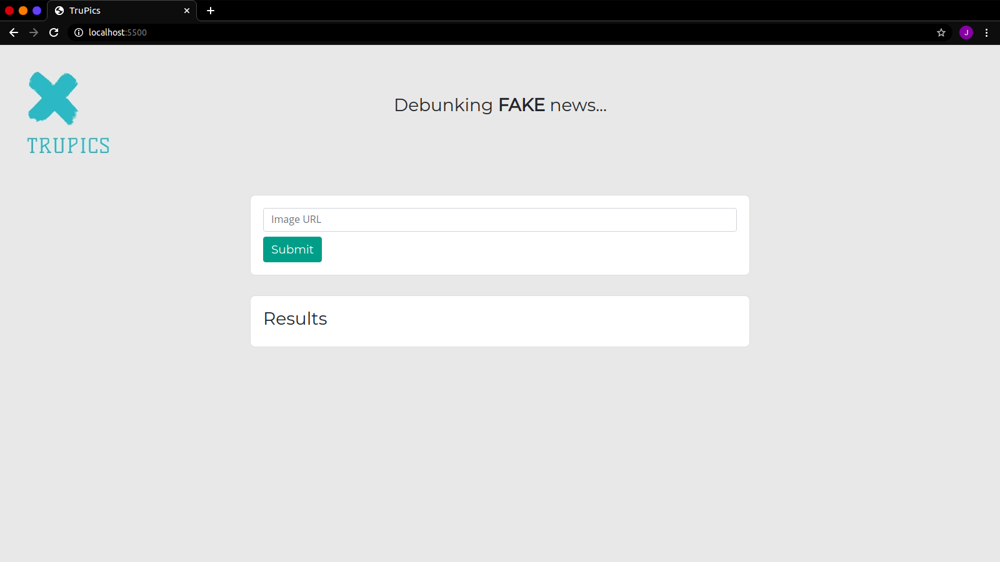
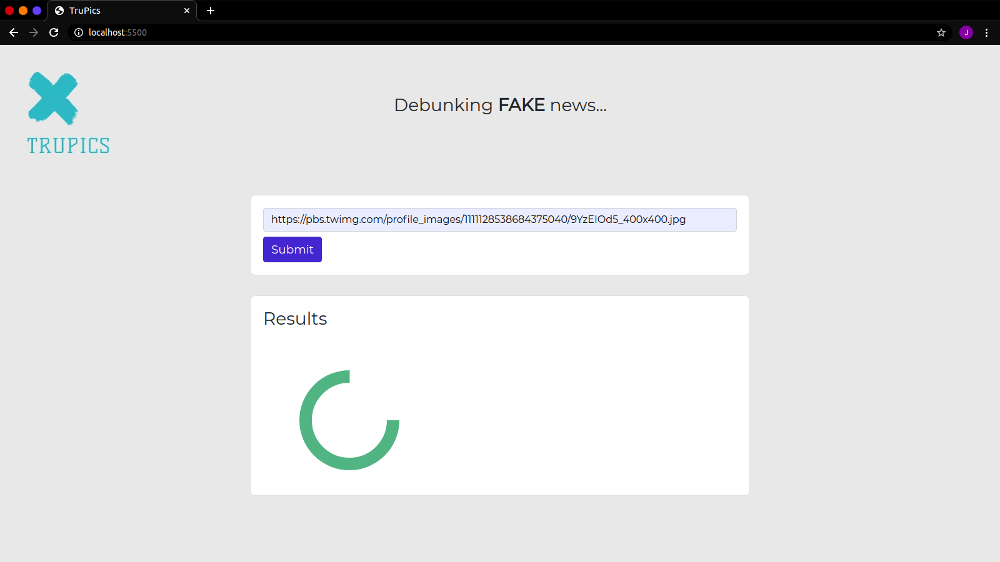
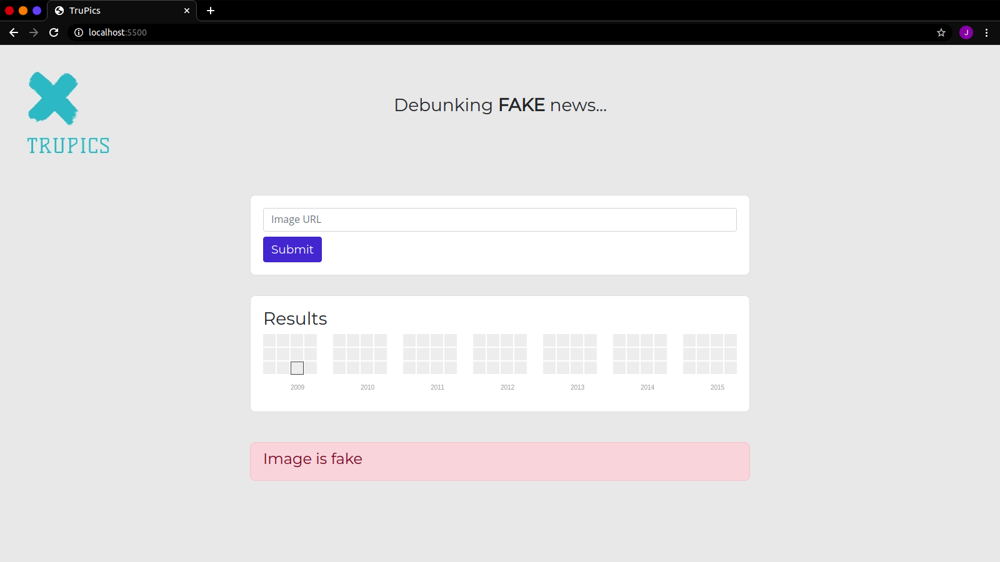

# TruPics

## About
An app that let's you know if an image is a recent viral news or an old one, and hence helps you decide which news is real and which is fake. Built for the HackDoomna Hackathon '20 at IIIT-DM Jabalpur

## Screenshots

## Setup
Download MRISA API from https://mrisa.mage.me.uk/ and run the server. Run flask/server.py in the virtual environment and optionally run index.html on live server or just open index.html. 
